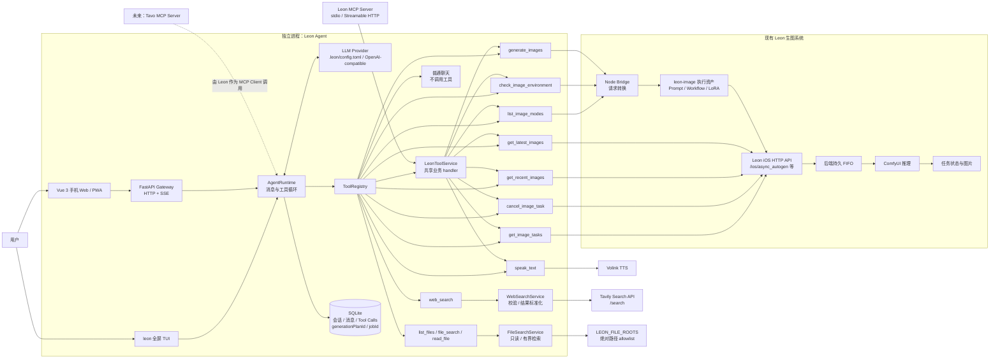

# Leon Agent 总体架构

下面的 Mermaid 是可维护的权威结构。旧 PNG 展示图已移除，避免把已完成的 TUI、Web、MCP
边界误读成历史状态；“原生 Python / Node Bridge”表示适配层的可选实现，当前代码实际使用
Node Bridge。



## 一次生图的数据流

```text
用户明确提出生图
  -> LLM 选择 generate_images
  -> ToolRegistry 校验参数并执行
  -> Node bridge 调用原插件 buildRequest
  -> POST /ios/async_autogen
  -> 返回 generationPlanId / jobId
  -> SQLite 记录任务身份
  -> Agent 告知“已提交”，不冒充“已完成”
```

## 一次文件检索的数据流

```text
用户要求查阅本地资料
  -> Agent 先用 list_files / file_search 定位
  -> ToolRegistry 校验 root_id、相对路径和数量边界
  -> workbench_core.FileSearchService 重新解析并检查 containment
  -> 跳过隐藏、敏感、链接和不支持的文件
  -> 返回 root_id:path:line 形式的 citation 与 untrusted_content 标记
  -> Agent 只把文件内容当作证据，按证据回答
```

## 边界

- Agent 是独立程序，原 Tavo 插件继续独立工作。
- 工具定义当前属于 Agent；原后端提供 HTTP 能力，而不是直接提供 Agent tool schema。
- Bridge 不重新实现生图策略，只调用原插件生成资产。
- SQLite 不保存完整 workflow、插件 provider key 或请求 payload。
- `web_search` 通过独立 `WebSearchService` 调用 Tavily，不进入图片专用的
  `LeonToolService`；未配置 `TAVILY_API_KEY` 时不注册该工具。
- File Search 通过 `workbench_core.files.FileSearchService` 复用路径隔离、敏感文件屏蔽和扫描预算；
  `LEON_FILE_ROOTS` 为空时不注册 `list_files`、`file_search`、`read_file`。
- File Search 只读且只接受配置 root 内的相对路径；绝对路径、越界路径、symlink/reparse point、
  `.env`/密钥/数据库和二进制内容不会进入 Agent 结果。它目前不属于 Leon MCP Server 的工具集合。
- Leon MCP Server 第一版已落地在 `projects/04-mcp-lab/leon-mcp-server`；它复用
  `LeonToolService`，不复制 Prompt、Workflow 或 LoRA。当前默认提供 stdio 和 Streamable HTTP
  两种 transport，HTTP 默认只监听 `127.0.0.1`。
