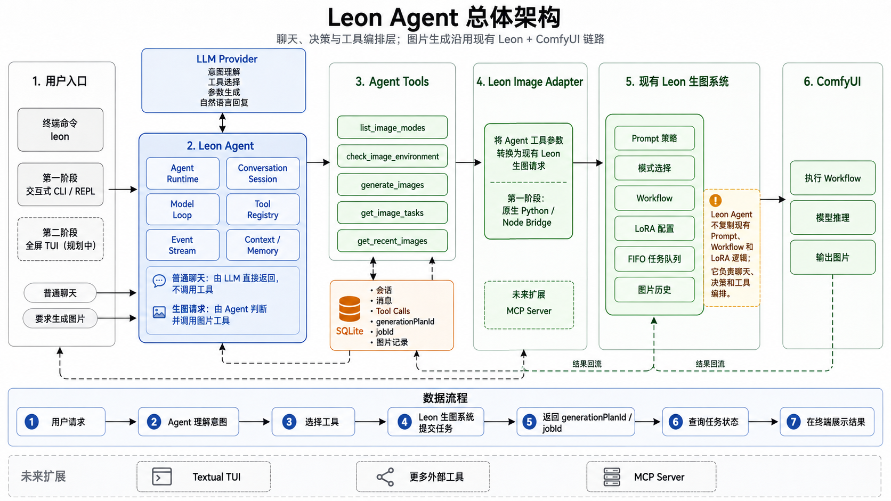

# 02-leon-agent

独立运行的个人 Agent：终端聊天，必要时调用现有 Leon / ComfyUI 生图能力。



## 当前能力

- `leon` 交互式 CLI / REPL
- `leon-server`：FastAPI Gateway + SSE + 手机 PWA Web Client
- 普通问题直接聊天，不调用工具
- 明确生图请求优先路由工具，用户原话作为 `source_text` 透传，不由 Agent 扩写 Prompt
- 7 个 Leon 生图工具：模式、环境、自助生成、任务、取消任务、会话图库、全局最近图片（数量可调）
- SQLite 持久化会话、消息、tool call、`generationPlanId` 和 `jobId`
- 复用 `leon-image` 的 `executor-core.js + executor-assets.js`
- 调用现有 `/ios/*` HTTP 接口，不复制 Prompt、Workflow 或 LoRA 配置
- 任务与图库返回的图片地址统一补全成绝对 URL，可直接打开
- CLI 与 Web 设置页从当前 LLM provider 的 `/models` 动态读取模型目录，手输模型 ID 保持原始大小写
- Web 全屏图片查看器是可缩放相册：左右切换、计数、滑动翻页、双指 / 双击定点缩放、平移夹在真实图片边界内
- 生图完成后丢弃骨架屏，在聊天底部追加一条新图片气泡并自动跟随到底
- 任务页以生图模式和中文状态为主信息，内部任务 ID / 生成计划 ID 收进折叠详情
- 模型选择改为可点击列表（不再依赖手机浏览器不友好的 `<datalist>`）
- Volink TTS 已接入：4 个模型 / 561 个中文音色，支持搜索、收藏、试听、手动朗读与自动朗读
- TTS 会在前后端清理 Markdown 列表符号、emoji、链接、模式 ID 和任务 ID，换行转成自然停顿
- SSE 的 `voice.ready` 事件会在聊天中追加可播放的语音气泡；播放器支持单例复用、iOS 用户手势解锁和待播恢复
- 助手气泡支持复制、重试、编辑和朗读；编辑后的文字会成为后续朗读内容
- iOS 有声播放使用单例播放器 + 用户手势解锁，被拦截时保留待播音频并显示开启按钮
- Vue 3 + Vite 迁移已覆盖聊天、任务、图库和设置视图；聊天输入支持 `/nsfw --model` 模式名称补全，按名称、ID 和别名过滤
- Agent Timeline 可查看最近 100 条 SSE 决策事件，并过滤高频 `assistant.delta` 字符增量
- 可用 `LEON_SYSTEM_PROMPT_FILE` 从项目私有 TXT 追加 system prompt，CLI 与 Web 共用

Codex、Notion AI 或其他 Agent 开发前先读
[AI 协作状态](docs/AI-COLLABORATION.md)，其中记录唯一源码路径、事件协议、模型选择契约和交接格式。

## 运行边界

```text
leon Agent（独立进程）
  -> Agent Runtime 和工具列表（ai-workbench）
  -> Node bridge（只做请求转换）
  -> leon-image 现有执行资产
  -> Leon / ComfyUI 后端
```

原 Tavo 插件不依赖 Agent，也不需要为了第一版增加 Agent 代码。未来可把这些工具迁移成
Leon MCP Server，让 CLI、Codex 或其他 Host 共用。

完整图见 [Leon Agent 架构](../../docs/leon-agent-architecture.md)。

## 快速开始

在仓库根目录运行：

```powershell
uv sync
uv run leon
```

启动手机 Web Client：

```powershell
uv sync
uv run leon-server --host 127.0.0.1 --port 8233
```

本机浏览器打开 `http://127.0.0.1:8233`。通过 Cloudflare Tunnel 暴露时，使用
`https://leon.928886540.xyz`，并在登录页输入 `.env` 中的 `LEON_API_TOKEN`。Windows 部署与
Tunnel 缓存规则见 [Windows + Cloudflare 部署](docs/windows-cloudflare-deploy.md)。

恢复已有会话：

```powershell
leon resume 6b34ef29606447d395f05899ba30abf7
```

恢复后会继续使用该 session 在 SQLite 中保存的消息历史。旧写法
`leon --session <session_id>` 继续兼容。

交互命令：

- `/new`：创建新会话
- `/history`：查看本地会话
- `/model`：显示当前模型与可选模型
- `/model <序号或任意模型ID>`：切换当前 session 的模型
- `/model default`：恢复 `~/.codex/config.toml` 的默认模型
- `/nsfw <描述>`：绕过 LLM，使用默认的玛莉卡模式直接生图
- `/nsfw --model <中文名或模式ID> <描述>`：指定生图模式，例如
  `/nsfw --model 蒂法增强 生成一张雨夜人像`
- `/nsfw` 或 `/nsfw --models`：列出当前安装模式的中文名和真实 ID
- `/exit`：退出

启动时直接读取 CC Switch 写入的 `~/.codex/config.toml`，使用其中当前 provider 的
`base_url`、`experimental_bearer_token` 和顶层 `model`。`/model` 接受列表序号或任意新
model ID，只替换当前会话请求中的 model；URL 与密钥仍跟随配置文件。选择会写入当前
SQLite session，之后执行 `leon resume <session_id>` 仍会恢复该模型。

单次调用：

```powershell
uv run leon --once "解释一下 Agent loop"
uv run leon --once "用 k2_tifa 给我生成一张雨夜街头图片"
```

要在任意目录直接输入 `leon`，安装本地命令：

```powershell
uv tool install --editable .\projects\02-leon-agent `
  --with-editable .\packages\workbench_core
```

## 配置

| 环境变量 | 默认值 | 作用 |
|---|---|---|
| `LEON_BACKEND_URL` | `http://192.168.8.100:8188` | Leon / ComfyUI 后端 |
| `LEON_PUBLIC_IMAGE_BASE_URL` | 空（回退到 `LEON_BACKEND_URL`） | 生成图片链接时使用的对外地址，例如 `https://comfyui.928886540.xyz` |
| `LEON_PLUGIN_DIR` | 自动发现同级 `ComfyUI-aki` | 原插件目录 |
| `LEON_DEFAULT_IMAGE_MODES` | `k2_tifa_plus` | 未指定模式时的默认值，逗号分隔 |
| `LEON_SESSION_DB` | `data/leon-agent.db` | 本地会话数据库 |
| `LEON_API_TOKEN` | 空 | Web Gateway 鉴权 token；公网暴露时必须设置 |
| `LEON_WEB_CLIENT` | `legacy` | Web 客户端实现；Vue 构建完成并验收后再切为 `vue` |
| `LEON_SYSTEM_PROMPT_FILE` | 空 | 可选 UTF-8 TXT；内容原样追加到 Agent system prompt，相对路径从仓库根目录解析 |

后端返回的图片可能是 `/view?filename=...` 这类相对路径。工具层会把它拼成
`LEON_PUBLIC_IMAGE_BASE_URL`（未配置时用 `LEON_BACKEND_URL`）下的绝对地址，已经是
`http(s)://` 的地址保持原样。也可以临时用 CLI 覆盖：

```powershell
uv run leon --public-image-base-url https://comfyui.928886540.xyz
```

模型配置默认读取 `~/.codex/config.toml`；可用 `CODEX_CONFIG_PATH` 指定其他路径，或通过
`LLM_SOURCE=ccs/env` 使用旧 CC Switch DB / 手工环境变量。它与生图后端配置分离。

## 验证

```powershell
uv run pytest projects/02-leon-agent/tests -q
uv run ruff check projects/02-leon-agent
uv run leon --help
uv run leon-server --help
```

单元测试不会提交真实生图。环境自检也是只读；只有模型明确调用 `generate_images` 才会创建任务。

## Mobile Web Client

legacy Web 客户端的 5 个阶段均已完成：HTTP Gateway、SSE 事件流、手机 PWA 聊天、任务/图库视图，以及运行时间线。
Web Gateway 提交生图任务后立即通过 SSE 推送任务模式和内部 job id，并在后台跟踪状态和完成图片；CLI 仍保留
同步等待图片结果的体验。图片完成后 Gateway 会主动持久化并推送一条带图片的助手消息，Web
聊天气泡直接显示图片，不需要再次询问 LLM。Web 设置页可为当前 session 选择模型，或恢复跟随 Codex 配置中的
默认模型；选择会与 CLI 共用同一份 SQLite 会话状态。

任务页默认显示中文模式名、用户原始描述和中文状态；`job_id` / `generation_plan_id` 只在
“任务详情”中展开。TTS 的 `502` 代表 Volink 上游失败，不是本项目的文本长度限制；网关会记录
原始字符数、净化后字符数和上游错误，Web 会显示返回的 `detail`，当前不做无依据的自动重试。

Vue 客户端已迁移聊天、任务、图库和设置四个主要视图，并复用同一套 Gateway/SSE 协议。
聊天输入在识别 `/nsfw --model ` 前缀后按模式名称、真实 ID 和 aliases 提供异步候选，支持点击、
上下键、Enter 选择和 Esc/失焦收起；用户上滚时会保留阅读位置并显示“回到最新”，输入框按内容自动增高，
错误原文默认折叠；Agent Timeline 收集最近 100 条 SSE 决策事件，支持清空并跳过高频 `assistant.delta`；
候选目录请求只走 `/api/image-modes`，不会触发 LLM 或真实 provider。

架构与接口边界见 [Mobile Web 架构](docs/mobile-web-architecture.md)。

legacy Web 客户端仍由单文件 `src/leon_agent/web/index.html` 提供（无构建步骤），`tests/test_gateway.py`
直接对服务端返回的 HTML 做字符串断言；Vue 客户端的源码位于 `web/src/`，两者并行维护。每次 legacy
前端改动需同步递增 `sw.js` 的缓存名与注册 `?v=` 版本号，否则手机会命中旧缓存。当前 Vue 迁移的边界与
验收状态见 [Web 客户端演进评估](docs/web-client-evolution.md)。

Vue 3 + Vite 迁移基座位于 `web/`，当前已覆盖聊天、任务、图库、设置视图和 Agent Timeline。provider-free
Playwright 回归脚本 `tests/manual_vue_web_check.py` 已在 Vite preview 和 FastAPI Vue 入口各跑通 **18/18**；
它拦截所有 `/api/**`，不会触发真实 LLM、Volink 或图片 provider。真实 Gateway/Cloudflare/SSE 和手机验收仍待做。
默认 `LEON_WEB_CLIENT=legacy`，构建 Vue 产物不会改变现有线上页面；完成线上验收后，设置
`LEON_WEB_CLIENT=vue` 并重启 `leon-server` 才会由 FastAPI 托管 `web/dist/`。

## 后续路线

Web 前端的 Vue3 迁移边界、模式补全、Agent Timeline、TTS/`voice.ready` 事件和浏览器回归见
[Web 客户端演进评估](docs/web-client-evolution.md)。

已记录三条扩展需求：面试 MCP、Telegram Bot、Tavo 互通。详细边界与实施顺序见
[Leon Agent 扩展路线](../../notes/plans/leon-agent-expansion.md)。

当前优先级是 MCP Server -> Telegram Bot -> Leon Agent 连接 Tavo MCP。Tavo v1.0.0 的聊天
工具调用暂不能接入外部 MCP Server，等宿主能力开放后再做 Tavo -> Leon MCP。
